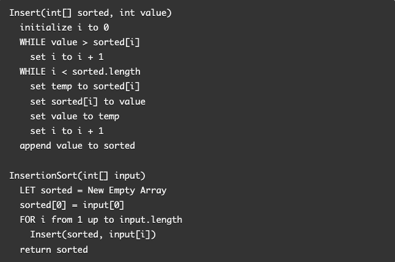
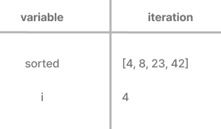

# Insertion Sort

According to Wikipedia,
> Insertion sort is a simple sorting algorithm that builds the final sorted array (or list) one item at a time by comparisons.

## Provided Pseudocode

## Step One: Understand the Pseudocode

## Example Given

Input: `[8, 4, 23, 42, 16, 5]`

Output: `[4, 5, 8, 16, 23, 42]`

## Pass #1

**Scope**: InsertionSort

**Scope**: Insert

**TODO***: add explanation

## Pass #2

**Scope**: InsertionSort

**Scope**: Insert

**TODO***: add explanation

## Pass #3

**Scope**: InsertionSort

**Scope**: Insert

**TODO***: add explanation

## Pass #4

**Scope**: InsertionSort

**Scope**: Insert

**TODO***: add explanation

## Pass #5

**Scope**: InsertionSort

**Scope**: Insert

**TODO***: add explanation

**TODO***: add Big O for time and space complexity

**TODO***: convert pseudocode into working code

**TODO***: add working tests

## Other Input Array Examples

Reverse-sorted: `[20, 18, 12, 8, 5, -2]`

Few uniques: `[5, 12, 7, 5, 5, 7]`

Nearly-sorted: `[2, 3, 5, 7, 13, 11]`

## Sources

- [Wikipedia](https://en.wikipedia.org/wiki/Insertion_sort)
- [Selection Sort Example](https://codefellows.github.io/common_curriculum/data_structures_and_algorithms/Code_401/class-26/solutions/BLOG)
